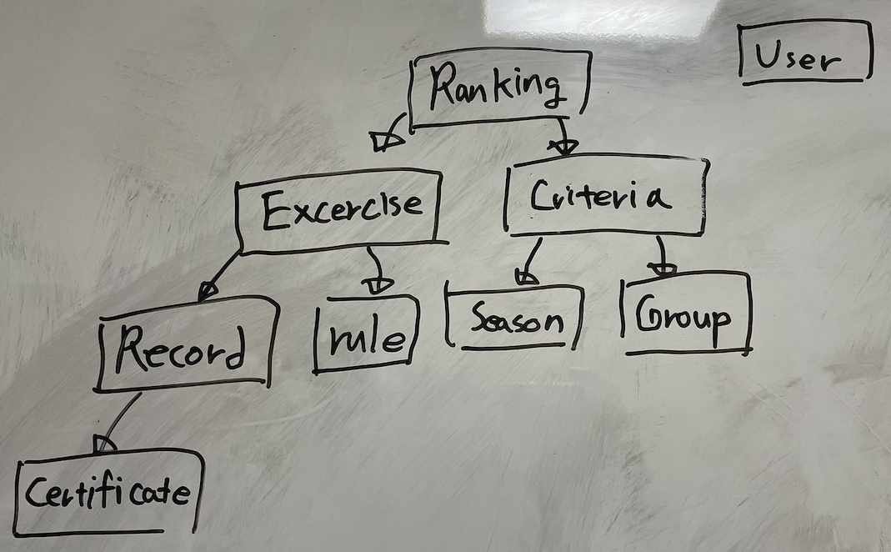
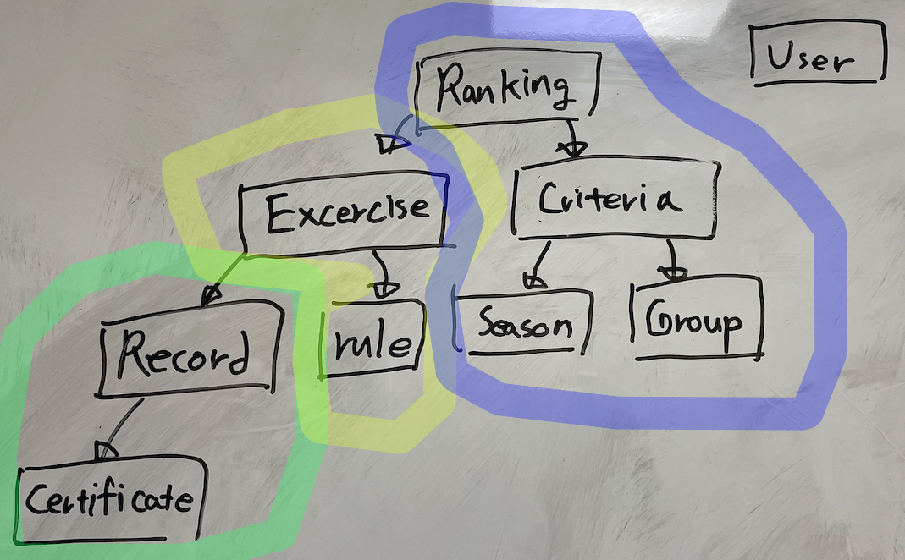

사이드 프로젝트를 진행하면서 Implementing Domain-Driven Design을 읽고 있었다. 내용이 너무 커서 책을 읽는 속도가 프로젝트 진행속도에 따라가지 못했다. 이에 같은 저자의 가벼운 Domain-Driven Desiong Distlled를 읽고 프로젝트에 적용해보려고 한다.

# 바운디드 컨텍스트 정의

우리 프로젝트는 헬스 기록을 등록하면 랭킹을 보여주는 앱이다. 현재 정의된 기능을 간단하게 나열하면 다음과 같다.

- 3대 측정 기록 등록
- 측정 기록 인증
- 3대 측정 순위 표출 

- 주위 헬스장 안내
- 헬스장 기구 정보/리뷰 표시

- 회원 가입 / 로그인
- 회원 정보 수정

Ranking, Gym, User 이렇게 세개의 바운디드 컨텍스트로 나누고 Ranking을 Core 도메인으로 정의했다. 기록을 등록하는 Record를 따로 분리할지 고민했는데 기록 등록은 랭킹을 산정하기위한 서브도메인이라는 결론을 내렸다.

회원정보를 관리하는 User와 토큰 발급(로그인)/인증을 관리하는 Auth를 분리할지도 고민됐다. 명확히 하기위해 다음과 같이 회원가입/로그인 시나리오를 적어봤다.

`사용자는 카카오나 구글 OAuth를 통해 sid를 발급받고 sid가 등록되어있으면 로크인, 되어있지 않으면 회원가입을 한다. 회원가입이 완료되면 자체 id가 발급된다. 로그인 시 자체 id를 포함한 토큰을 발급받는다. 토큰은 rsa알고리즘으로 서명되며 각각의 서버에서 자체적으로 인증한다.`

토큰 발급 시 회원식별자와 sid만 필요하고 나머지 회원정보를 알지 못해도 되고 로그인과 회원정보의 트렌젝션 범위가 구분되므로 auth가 다른 바운디드 컨텍스트로 분리되어도 될것같다. 하지만 로그인 하나만으로 컨텍스트를 쪼개기에는 너무 범위가 작은 것 같아 User에 통합했다.

## Ranking core domain 정의

랭킹 등록 시나리오는 다음과 같다.

`회원가입한 유저는 기록을 등록할 수 있다. 기록을 등록할 수 있는 종목은 스쿼트, 벤치프레스, 데드리프트 세가지이다. 기록이 종목별 기준값보다 크면 등록시 인증 파일을 첨부해야한다. 기준값보다 낮은 기록은 바로 랭킹에 반영되어 순위가 표시되고 기준값보다 큰 기록은 심사를 통해 반영된다. 랭킹은 종목별로 유저 기록 중 시즌 내 가장 큰 값으로 계산된다.`

위 시나리오에서 랭킹 바운디드 컨택스 내 도메인을 다음과 같이 정의헀다

정의된 도메인 내에서 트렌젝션 별로 어그리게이트를 나눠봤다.

랭킹이 기록 등록과 함께 실시간으로 업데이트 되어야하면 같은 어그리게이트에 묶이는게 맞겠지만 모든 기록 등록이 랭킹의 변화로 이어지지 않고 기준치 이상의 기록은 심사가 완료되어야 업데이트 되기 때문에 다른 트렌젝션에서 처리된다고 판단했다.

### 랭킹 컨텍스트에서 자체적으로 유저를 정의해야할까?

User 서비스에서 모든 유저 정보를 관리할 수 있다. 하지만 생년월일, 성별, 몸무게를 수집하는 이유는 나중에 Ranking서비스에서 나이별, 체급별, 성별 별로 랭킹을 계산하기 위한 목적이다. 랭킹에서 유저를 새롭게 `Athlete`란 엔티티로 정의하고 관리할지 유저 서비스에서 정보를 가져올지 고민됐다.

#### 해결

생년월일, 성별은 랭킹이 아닌 다른 서비스에서도 사용될 수 있는 속성이다. 유저는 랭킹에서 엔티티보다는 VO이기도 하다. 유저 서비스가 해당 엔티티를 관리하고 컨텍스트 매핑으로 두 바운디드 컨텍스트를 연결하는게 낫다고 생각했다.

내가 두 바운디드 컨텍스트 개발에 관여하므로 변경을 추적할 수 있고, 랭킹에는 전체 유저정보가 필요한데 통신으로 전달하기는 데이터가 크고 전달이 빈번해 shared kernel 방식이 알맞다고 생각했다.
유저 정보가 업데이트 되는 경우 도메인 이벤트를 정의하고 랭킹 서비스에서 새로운 기준으로 랭킹을 업데이트한다.

